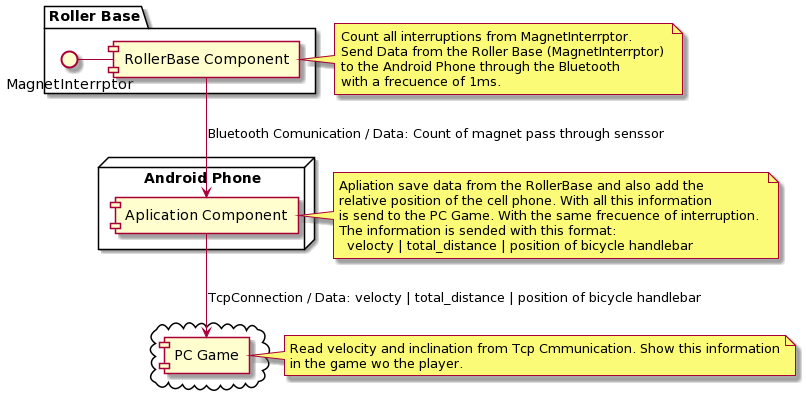
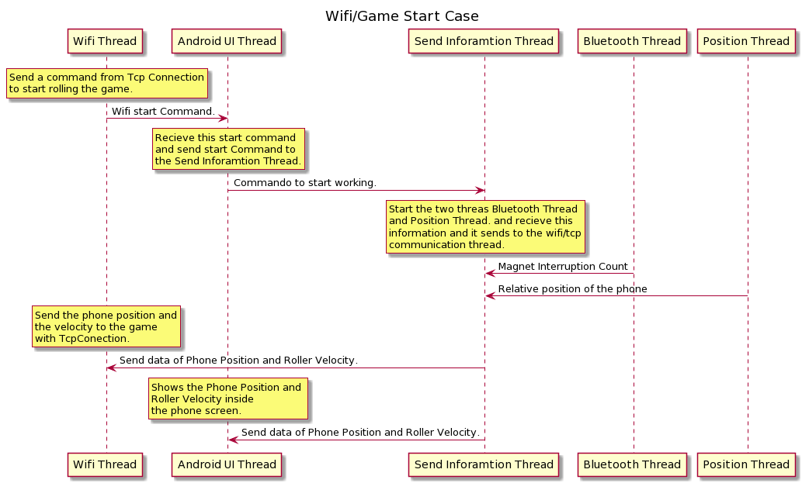
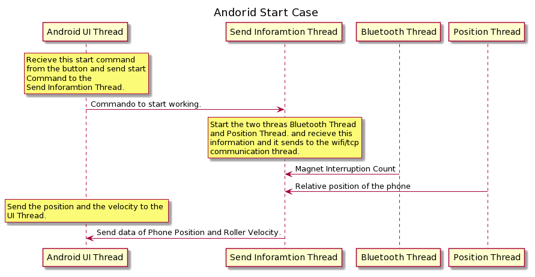

## Idea of App:

The idea of this app is read comming data from rolling base through bluetooth. And show this information in
the main screen of the aplication. Also the app reads the phone orientation.
From the base comes the times pass through the megnetic sensor and with this data, the app can callculate the distance 
and teh velocity of the roller.

All this information is send through TCP connection (called Wifi in class app), the information is organiced:
    velocity  | Total Distance | Position

## Diagrma of information flow

Here is a small diagram, how the information flows from the base to the Android phone and 
in the case to the pc game.

## Requierements:

Cell phone: Android 6.0 Marshmallow  or higher version.
Wifi Connection.
Bluetooth Connection.

## Class Eplanation:

Father package: com.example.bikebluetoothwifi

### Carpetas:
    general : store general data.
    io : stare classes to manage the io conections.
    thread : store classes to manage threads.

#### Archivos:
    BluetoothActivity.java :  Activity to configure bluetooth connection.
    MainActivity.java : Activity to show all app information.
    WifiActivity.java : Activity to configure wifi connection.
    AplicationState.java : Singleton to centralize all information from the aplication.

#### io
    BluetoothConnection.java : Singleton to manage all io-bluetooth information
    WifiConnection.java : Singletone to manage al TCP/Wifi connection.

#### general
    DataCalculate.java : Class to calculate data depending on roller size.

#### thread
    BluetoothRunner.java : class is a runner (thread) implemetation to listen input data stream from bluetooth.
    WifiRunner.java : class is a runner (thread) implemetation to listen/send data stream through tcp connection.
    SendDataRunner.java : class is a runner (thread) implemetation to recieve data from BluetoothRunner and PositionRunner, 
                and send this data to the UI main thread and to the TCP/Wifi connection. (WifiConnection class)
    PositionRunner.java :  class is a runner (thread) implemetation to listen cell phone position.

## App Screen:

### Main app screen:

### Bluetooth screen:

### Wifi screen:

To run this app, you have to connect first Bluetooth, through Bluetooth screen. After that you have to establish 
Wifi communication, through Bluetooth screen. And finally, you can press Start Running in the main screen and start
training.

## Working Modes

This is a secuence diagram of working modes of the program.

TcpConnection/Game Starting:
After TcpConnection is completed, you can start running with the base.

Aplication Starting:
This starts from the aplication.

## Tricky Programing

In the file: PositionRunner.java

[PositionRunner.java](https://github.com/martinfantini/BikeBluetoothWifi/blob/timer_to_send/app/src/main/java/com/example/bikebluetoothwifi/thread/PositionRunner.java)

there is a variable definied with

private static final int MOVEMENT_SENSOR_DELAY = 500;

This varaible is used to define time period of samples of phone change position.
In this case this time is in microSeconds.

When this data comes to the file: SendDataRunner.java

[SendDataRunner.java](https://github.com/martinfantini/BikeBluetoothWifi/blob/timer_to_send/app/src/main/java/com/example/bikebluetoothwifi/thread/SendDataRunner.java)

It is send with the same period diveded by the variable:

private static Integer MAX_SAMPLES_BEFORE_SEND = 3;

The tests i made i have this results:

- 3 \=\> \~20 HZ
- 5 \=\> \~10HZ

This means that, the programer has not change this TWO values because they are depending one of the another.

Why I did use Timer class?

Because it affects all the timers inside the phone. Because the code i program for timer affects all the running threads.
[Timer Android](https://developer.android.com/reference/java/util/Timer)
