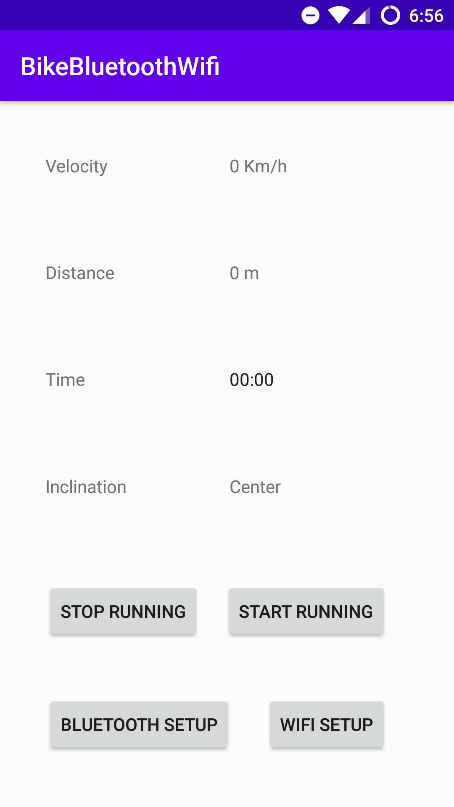
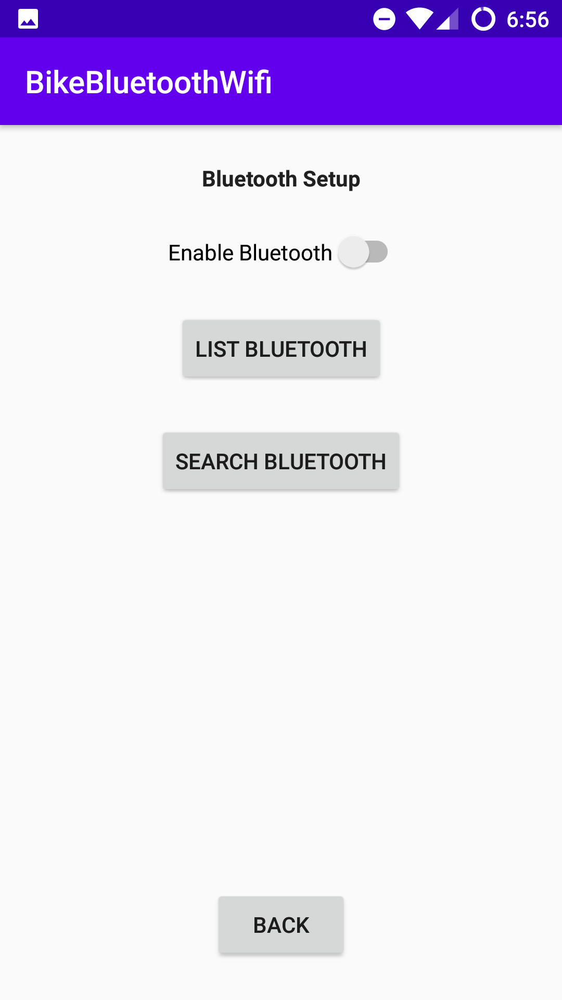
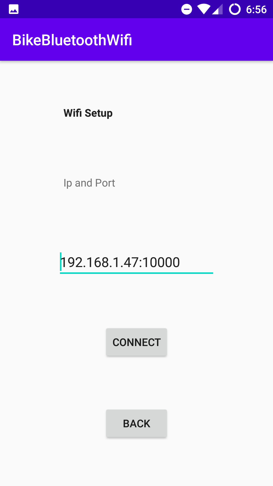

## Idea of App:

The idea of this app is read comming data from rolling base through bluetooth. And show this information in
the main screen of the aplication. Also the app reads the phone orientation.
From the base comes the times pass through the megnetic sensor and with this data, the app can callculate the distance 
and teh velocity of the roller.

All this information is send through TCP connection (called Wifi in class app), the information is organiced:
    velocity  | Total Distance | Position

## Requierements:

Cell phone: Android 6.0 Marshmallow  or higher version.
Wifi Connection.
Bluetooth Connection.

## Class Eplanation:

Father package:
    com.example.bikebluetoothwifi

Carpetas:
    general : store general data
    io : stare classes to manage the io conections.
    thread : store classes to manage threads

Archivos:
    BluetoothActivity.java :  Activity to configure bluetooth connection.
    MainActivity.java : Activity to show all app information.
    WifiActivity.java : Activity to configure wifi connection.
    AplicationState.java : Singleton to centralize all information from the aplication.

### io
    BluetoothConnection.java : Singleton to manage all io-bluetooth information.
    WifiConnection.java : Singletone to manage al TCP/Wifi connection.

### general
    DataCalculate.java : Class to calculate data depending on roller size.

### thread
    BluetoothRunner.java : class is a runner (thread) implemetation to listen input data stream from bluetooth.
    WifiRunner.java : class is a runner (thread) implemetation to listen/send data stream through tcp connection.
    SendDataRunner.java : class is a runner (thread) implemetation to recieve data from BluetoothRunner and PositionRunner, 
                and send this data to the UI main thread and to the TCP/Wifi connection. (WifiConnection class)
    PositionRunner.java :  class is a runner (thread) implemetation to listen cell phone position.

## App Screen:

### Main app screen:

### Bluetooth screen:

### Wifi screen:

To run this app, you have to connect first Bluetooth, through Bluetooth screen. After that you have to establish 
Wifi communication, through Bluetooth screen. And finally, you can press Start Running in the main screen and start
training.